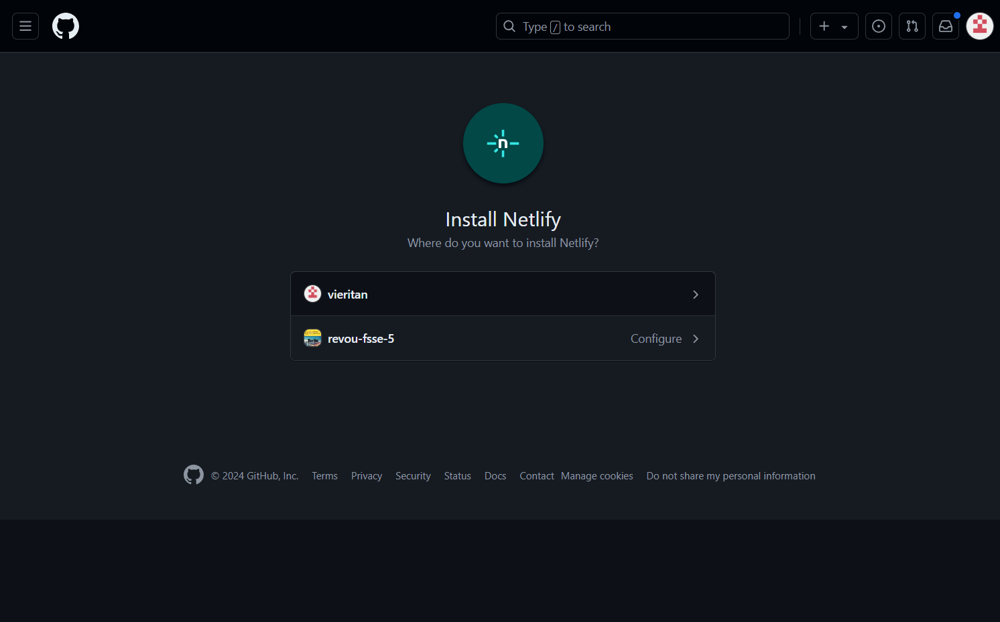

**PENJELASAN TENTANG WEBSITE**

#Deskripsi Website
 * saya menggambil contoh tentang perusahaan sepatu yang dimana saya mendapatkan inspirasi dari nike commpay
 * di dalam website saya menggunakan sedikit elemt yang dimana salah satunya menggunakan animasi pulldown dan parallax, responsive card dan sisanya menggunakan flex dan media screen serta accordion.
 * untuk footer saya mencari refrensi web yang ada di google
 * untuk bagian kontennya saya tidak banyak menggunakan emelent yang di pakai karena keterbatasan waktu

* untuk bagian heading hanya menggunakan navbar dan beberapa animasi seperti pulldown
* pada bagian wallpaper menggunakan parallax dan tidak ada tambahan lainnya

* untuk bagian main menggunakan card box sederhana dan animasi responsif card
* dan selanjutnya menggunakan accodion
* yang berisi tentang informasi dan leader di dalam perusahaan

* pada bagian footer hanya menggunakan element sederhana

#Deskripsi Website
 * saya menggambil contoh tentang perusahaan sepatu yang dimana saya mendapatkan inspirasi dari nike commpay
 * di dalam website saya menggunakan sedikit elemt yang dimana salah satunya menggunakan animasi pulldown dan parallax, responsive card dan sisanya menggunakan flex dan media screen serta accordion.
 * untuk footer saya mencari refrensi web yang ada di google
 * untuk bagian kontennya saya tidak banyak menggunakan emelent yang di pakai karena keterbatasan waktu

##cara untuk koneksikan GitHub ke Netlify

* untuk mendeploy ke netlify harus upload dulu ke github
dan selanjutnya pilih deploy yang ada di github

* setelah di upload ke dalam netlify langkah pertama adalah menghapus domain yang sebelumnya kalian pakai di website

* langka berikutnya adalah mengganti dengan nama domain yang baru

* setelah menentukan nama domain kalian tunggu beberapa saat

## Hasil domainnya
https://milestone.tugasrevou.online/